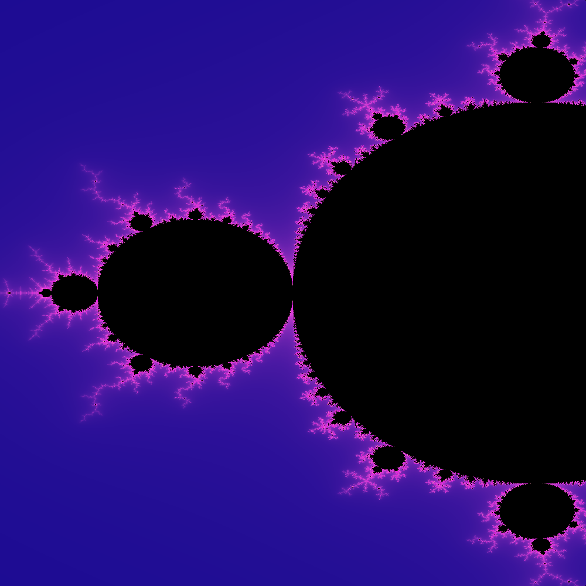

# Mandelbrot Set

Exploring generating image of the
[Mandelbrot Set](https://en.wikipedia.org/wiki/Mandelbrot_set)
in Clojure.

## Example Images

## TODO

* GIF Generation
    * Multiple images that loop, zooming into the original image
    * Likely will require additional optimization in image generation